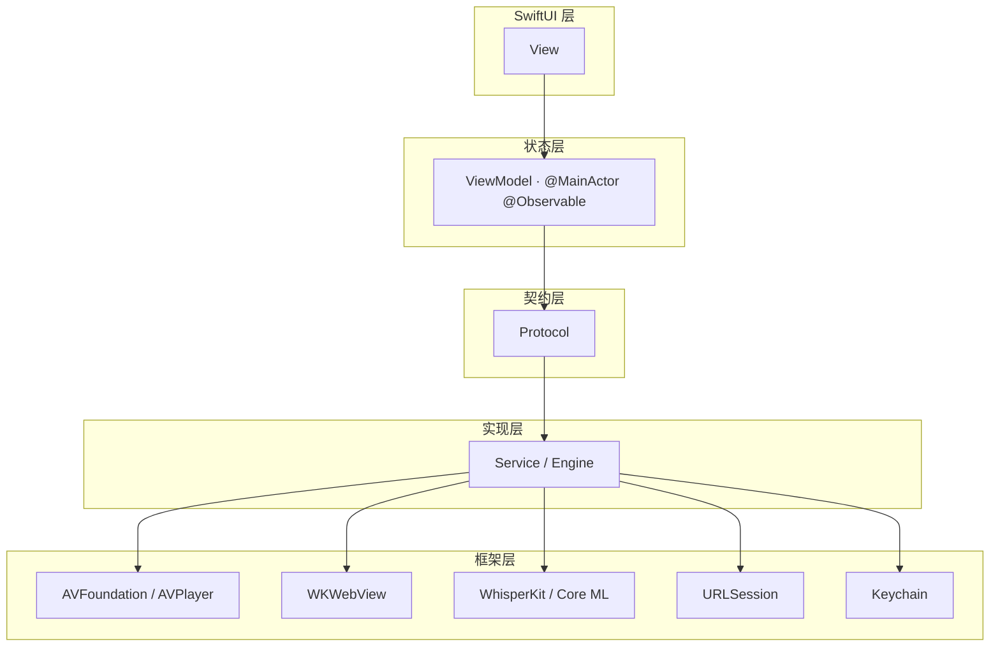

# AI Video Player — 架构文档

> 本文档是项目架构的事实来源。任何代码改动都不得违背「不可违反规则」章节中的内容。

## 1. 项目目标

高质量、可扩展、可维护、性能稳定、符合 Apple 原生设计规范的长期 iOS 项目。
产品形态：PotPlayer + 浏览器 + AI 实时字幕 + 远程文件浏览器的原生 iOS 视频播放器。

## 2. 分层架构



**数据流：View → ViewModel → Protocol → Service/Engine → Framework**

依赖方向永远向下；UI 层不知道具体实现类型，只知道协议。

| 层 | 职责 | 约束 |
|---|---|---|
| View | 纯展示与手势；绑定 ViewModel 状态 | 不持有业务逻辑；单文件 ≤ 300 行 |
| ViewModel | `@MainActor @Observable`；持有页面状态与协议依赖；发起可取消 Task | 不直接接触 AVPlayer / URLSession / WhisperKit |
| Protocol | 契约，业务与实现之间的唯一接口 | 业务层只依赖协议，不依赖具体实现 |
| Service / Engine | 实现协议，封装框架能力 | 可替换；通过 init 注入 |
| Framework | Apple / 第三方框架 | 只在 Service 层被触碰 |

## 3. 模块职责

| 目录 | 职责 | 当前 Phase |
|---|---|---|
| `App/` | App 入口、Tab 路由、全局状态（AppEnvironment） | 1 |
| `DesignSystem/` | Liquid Glass 组件（GlassCard / GlassBadge / GlassIconButton / GlassProminentButton / GlassTogglePill）、Theme 设计令牌 | 1 |
| `Features/Browser/` | 浏览器（地址栏/历史/收藏 + WKWebView）、媒体提取入口与远程文件浏览（WebDAV 目录导航） | 2 → 4 |
| `Features/Player/` | 播放器 UI 与状态（PlayerView + PlayerViewModel） | 1（占位）→ 3 |
| `Features/Subtitle/` | AI 字幕状态卡 + 整句字幕叠加（SubtitleStatusCard / SubtitleOverlay + ViewModel） | 1（Mock）→ 5/6 |
| `Features/Settings/` | 设置页（隐私说明与后续配置占位） | 1（占位）→ 7 |
| `Core/Protocols/` | 7 个核心协议（见第 4 节） | 1 |
| `Core/Models/` | 7 个数据模型（见第 5 节） | 1 |
| `Core/Mock/` | Mock 数据与 Mock 实现（浏览器/凭据/状态） | 1-2 |
| `Core/Networking/` | WebDAV 目录浏览（PROPFIND；SMB / FTP 后续补充） | 2 |
| `Core/Storage/` | Keychain 凭据、UserDefaults 配置/历史/收藏 | 2 |
| `AI/Speech/` | WhisperKit 语音识别（超前缓冲识别） | 5 |
| `AI/Translation/` | 可替换翻译引擎 | 7 |
| `Services/` | 业务服务（Playback / MediaExtractor） | 3-4 |
| `Utilities/` | 日志等通用设施 | 1 |

## 4. 核心协议

| 协议 | 职责 | 实现计划 |
|---|---|---|
| `MediaExtractor` | 网页 / 远程目录 → `[MediaItem]` | ✅ Phase 4（WebMediaExtractor） |
| `PlaybackEngine` | 封装 AVPlayer 生命周期（加载/播放/暂停/seek/倍速/音量） | Phase 3（AVPlayerPlaybackEngine） |
| `SpeechRecognizer` | 本地实时识别，输出 `AsyncStream<SubtitleSegment>`（partial / final；超前识别默认整句 final） | Phase 5（WhisperKitSpeechRecognizer） |
| `TranslationEngine` | 文本翻译（可替换） | Phase 7（API / 本地模型 / Mock） |
| `SubtitleEngine` | 字幕时间线管理（双语、同步） | Phase 6 |
| `RemoteFileBrowsing` | 远程文件浏览（connect / listDirectory / disconnect） | ✅ Phase 2（WebDAV；SMB / FTP 后续补充） |
| `SubtitleStatusProviding` | AI 字幕状态来源（状态流 + toggle） | Phase 5（WhisperKit 管线） |
| `CredentialStoring` | 密码存取（生产实现 Keychain） | ✅ Phase 2 |
| `RemoteServerProfileStoring` | 服务器配置存取（非敏感信息） | ✅ Phase 2 |
| `BrowserHistoryStoring` | 浏览历史存取 | ✅ Phase 2 |
| `BookmarkStoring` | 收藏存取 | ✅ Phase 2 |

业务层只依赖协议；具体实现（AVPlayer、WhisperKit、翻译 API）在各自 Phase 通过依赖注入接入。

## 5. 数据模型

| 模型 | 说明 |
|---|---|
| `MediaItem` | 可播放媒体资源（视频/音频、来源） |
| `RemoteFile` | 远程目录条目（类型、连接协议、大小、时间） |
| `SubtitleSegment` | 字幕行（时间区间、原文、译文、置信度、partial/final） |
| `AIState` | AI 字幕七态：OFF / LOADING / LISTENING / TRANSCRIBING / TRANSLATING / READY / ERROR |
| `AISubtitleStatus` | AI 字幕子系统状态快照 |
| `PlaybackState` | 播放状态机（idle / loading / ready / playing / paused / ended / failed） |
| `LoadState` | 异步加载五态：loading / ready / empty / error / cancelled |
| `RemoteCredentials` | 远程连接凭据（仅内存会话使用） |
| `RemoteServerProfile` | 服务器配置（名称 / 根 URL / 用户名；密码走 Keychain） |
| `BrowserHistoryEntry` | 浏览历史条目 |
| `Bookmark` | 收藏条目 |

## 6. 依赖注入

ViewModel 通过 init 接收协议实现，默认值指向 Mock，替换实现无需改动调用方：

```swift
BrowserViewModel(historyStore: any BrowserHistoryStoring = UserDefaultsHistoryStore(),
                 bookmarkStore: any BookmarkStoring = UserDefaultsBookmarkStore())
RemoteFilesViewModel(browser: any RemoteFileBrowsing = WebDAVFileBrowser(),
                     credentialStore: any CredentialStoring = KeychainCredentialStore(),
                     profileStore: any RemoteServerProfileStoring = UserDefaultsProfileStore())
SubtitleStatusViewModel(provider: any SubtitleStatusProviding = MockSubtitleStatusProvider())
```

未来真实实现以相同方式注入，业务代码零改动。

## 7. 状态管理与取消

- 所有 async Task 必须支持取消：`Task.checkCancellation()` + generation 令牌防止过期结果覆盖。
- 状态必须显式表达：`LoadState` 五态、`AIState` 七态、`PlaybackState` 状态机。
- 流式数据使用 `AsyncStream`（如 `SubtitleStatusProviding.statusStream`），随宿主视图 `.task` 生命周期自动取消。

## 8. 未来接入方式

### 8.1 AVPlayer（Phase 3）

1. 实现 `PlaybackEngine`：新建 `Services/Playback/AVPlayerPlaybackEngine`（`@MainActor`），封装 AVPlayer 的
   加载、播放、暂停、seek、倍速、音量，并暴露状态流（`AsyncStream<PlaybackState>`）供 ViewModel 消费。
2. 注入：`PlayerViewModel(engine: any PlaybackEngine)`，UI 只读 ViewModel 状态。
3. 禁止：View 或 ViewModel 直接持有 AVPlayer / AVPlayerLayer。

#### 8.1.1 全屏与方向（设计约束）

播放器必须提供类 YouTube 的全屏体验，满足以下硬性要求：

1. 使用 AVPlayer + SwiftUI 自定义播放器 UI，**不依赖 AVPlayerViewController**。
2. 支持播放器内部横屏切换（视频内容横屏时，播放器可旋转为横屏）。
3. 用户开启系统竖屏锁定时：
   - 点击全屏仍可进入横屏播放；
   - 退出全屏后恢复系统原方向。
4. 全屏模式隐藏非播放器 UI（Tab Bar、Navigation Bar、状态栏）。
5. 支持 iPad 多任务（Split View / Stage Manager）与不同尺寸类（compact / regular）适配。
6. 横屏与方向逻辑必须封装在 Player 模块内部（如 `PlayerOrientationController`），
   通过环境值/协议暴露给播放器 UI；**不得污染其他页面**，其他页面始终跟随系统方向。

实现约束：

- 方向覆盖使用受支持的系统机制（`supportedInterfaceOrientations` 委托 / Scene 级方向策略），
  禁止使用私有 API（如 `UIDevice.setValue`）——存在 App Store 审核风险。
- 全屏状态由 PlayerViewModel 持有（如 `isFullScreen`），方向控制器只响应此状态，
  播放器自身不持有全局方向状态。
- 若全屏后设备仍保持竖屏（自动旋转被系统锁定或失败），全屏控制栏提供「横屏全屏」手动按钮
  （`PlayerOrientationController.requestLandscape`）作为兜底，并可手动恢复竖屏。
- 控制栏提供「画面大小」滑块（0.5x...2.0x 缩放），仅影响播放画面显示，不影响布局与全屏逻辑。

#### 8.1.2 调试入口（开发期专用）

播放器空状态提供「播放示例媒体（调试）」按钮，加载 `MockRemoteFiles.sampleMediaItem`，
仅用于没有远程服务器时在开发期快速验证播放器，**不属于正式功能**。

- **删除方法**：移除 `PlayerView.emptyState` 中的调试按钮及对应文案即可；
- 正式入口为「远程文件视频行 → `AppEnvironment.requestPlayback`」，与调试按钮相互独立，
  删除调试按钮不影响播放链路。

### 8.2 WhisperKit（Phase 5）

1. 新增 `AudioPipeline`（负责从 AVPlayer 或麦克风取音频）。
2. 实现 `SpeechRecognizer`：`AI/Speech/WhisperKitSpeechRecognizer`，把 WhisperKit 的 partial / final 结果
   映射为 `SubtitleSegment` 并写入 `AsyncStream`。
3. 实现 `SubtitleStatusProviding` 的真实版本，替换 `MockSubtitleStatusProvider` 注入到
   `SubtitleStatusViewModel`。
4. 隐私：音频不离开设备，模型本地加载。

#### 8.2.1 超前识别（Lead-Ahead）：AI 先于播放听到音频

**核心思路**：默认不做「边听边出」的逐词字幕，而是让 AI 管线领先于用户听到的播放位置
Δ 秒（可配置，默认建议 3 秒，范围 2–10 秒）完成「听 → 转写 → 翻译」，
字幕在句子起点一次性整句出现，不再逐词跳动。

**开关与默认路径：**

- 超前识别是设置页可配置开关，**默认开启**；关闭后回到原始实时路径：
  不做 Δ 秒预缓冲，Whisper 按原样输出 partial → final，字幕逐词实时出现，
  识别完成后即时翻译（延迟叠加在识别延迟之后，但无启动缓冲）。
- 开关状态持久化（UserDefaults）；切换开关时需重建识别游标、丢弃已缓存的
  partial / final，避免新旧模式数据串扰。
- 麦克风等不可预读来源不适用超前模式：自动按原始路径处理（partial 低延迟降级），
  不要求用户手动关闭开关。

**实现方式：**

1. 播放器先缓冲 Δ 秒音频再开始播放；播放过程中保持超前缓冲，保证识别游标
   始终领先播放光标 Δ 秒（识别游标 = 播放光标 + Δ，只允许顺播）。
2. `AudioPipeline` 从超前缓冲中取音频（AVPlayer 播放缓冲 / 解码后的 PCM 缓冲），
   维护领先识别游标；麦克风等不可预读来源不适用本模式，走 partial 低延迟降级。
3. Whisper 对领先窗口内的音频提前分析，以句子级 final 为主输出
   （`SubtitleSegment` 整句），写入 `AsyncStream`。
4. 翻译紧随识别完成（Phase 7 的 `TranslationEngine`），在用户听到该句前译文已就绪；
   识别延迟与翻译延迟都被吸收在 Δ 秒窗口内，不叠加到用户可见延迟上。
5. 字幕仍以播放光标为时间基准（`SubtitleEngine` 对齐），句子起点到达时
   直接整句显示原文 + 译文。
6. 原始路径（开关关闭）：无预缓冲，`SpeechRecognizer` 按 partial → final 输出，
   翻译在 final 后即时执行；字幕逐词出现并最终整句稳定。

**体验权衡：**

- 收益：字幕整句一次出现、内容稳定；识别 + 翻译延迟被提前窗口隐藏。
- 成本：开始播放前需先缓冲 Δ 秒；直播/实况场景字幕相对真实世界事件滞后 Δ 秒
  （本地与普通视频中字幕仍与用户听到的声音同步）。
- Δ 过小（<2s）整句来不及合成；过大（>10s）明显滞后画面，需用户可调。
- seek / 缓冲卡顿时识别游标与播放光标会脱节，seek 后需重建领先窗口
  （重算 Δ、丢弃过期 partial / final，避免旧字幕覆盖）。

**状态语义：** `AIState` 的 LISTENING / TRANSCRIBING / TRANSLATING 表示领先窗口内的
AI 管线状态，与播放光标解耦；READY 表示当前播放位置的句子已整句就绪。

### 8.3 TranslationEngine（Phase 7）

`TranslationEngine` 保持单一协议，翻译能力由多个可替换的 Provider 实现，用户可在设置页选择：

**Provider 类型：**

1. **Fast NMT Provider（本地 / 轻量 NMT）**：基于 LibreTranslate、NLLB 等，适合极速、低消耗场景；
   完全本地运行，文本不出设备。
2. **Local LLM Provider（本地大模型）**：基于 Qwen、Gemma（4B 级）等本地模型，完全离线运行；
   无网络依赖，可在上下文润色模式下提供剧情感知翻译。
   **模型按需下载，不随 App 预置**：用户在设置页选择要使用的模型，点击「下载」后
   从 Hugging Face 拉取模型文件；下载需展示进度、支持失败重试与取消，
   下载完成后即可加载使用。
3. **Cloud LLM Provider（云端 API）**：基于 OpenAI 兼容格式（ChatCompletions API），支持用户自定义
   `baseUrl`、`apiKey`、`modelName`（如 deepseek-chat、gpt-4o-mini、claude-3-5-haiku 等）。
   启用前必须展示提示：「字幕文本将发送到你配置的翻译服务」。
   **配置后提供「测试连接」按钮**：填入 key / baseUrl / model 后先测试连通性与鉴权，
   测试成功才允许保存并启用；测试失败需展示具体错误提示。

**上下文润色（可选开关）：**

- 「剧情理解润色」开关**仅适用于本地 LLM 与云端 API**：开启后，会先理解当前剧情的上下文
  （历史字幕窗口），再基于语境翻译并润色，提升连贯性与可读性。
- **Fast NMT Provider 不参与上下文理解**：直接执行翻译，不发送上下文、不做润色，
  因此也不涉及上下文压缩。
- 必须注意**自动压缩文本**：向 LLM 发送上下文时需自动压缩（截断 / 摘要 / 滑动窗口），
  控制 token 消耗与延迟，避免上下文溢出。

**实现约束：**

1. 每个 Provider 都实现 `TranslationEngine` 协议，通过依赖注入接入字幕管线；
   译文写入 `SubtitleSegment.translatedText`。
2. 设置页提供 Provider 选择与对应配置（Base URL / API Key / Model / Language）。
3. 隐私：Fast NMT 与 Local LLM 完全本地；Cloud LLM 必须先行展示隐私提示。
4. 上下文窗口与压缩策略由独立组件管理（如 `TranslationContextProvider`），
   禁止把大段原始字幕直接塞进请求。
5. 超前识别模式下翻译紧随识别完成（领先播放光标）：用户听到该句前译文已就绪，
   翻译延迟被 2–10s 超前窗口吸收（翻译耗时应 < Δ），不叠加到字幕显示延迟上。
6. **仅 Fast NMT 也可独立支撑超前识别**：本地轻量翻译耗远小于 Δ 秒窗口，
   即使未启用本地 / 云端 LLM，翻译也随整句识别提前完成，字幕按时整句显示；
   LLM Provider 只提供「剧情理解润色」等增强能力，不是超前识别按时出字幕的前提。
7. 本地 LLM 模型按需下载：不随 App 预置；设置页提供模型选择、下载（Hugging Face 拉取，
   进度 / 失败重试 / 取消）、已下载模型管理与删除；下载完成后才能启用该 Provider。
8. Cloud LLM 配置提供「测试连接」按钮：向配置的服务发起一次最小请求，
   验证 baseUrl / apiKey / modelName 可用；测试成功才允许保存启用，失败需给出可读错误提示。

### 8.4 远程文件与浏览器（Phase 2）

1. 实现 `RemoteFileBrowsing`（WebDAV → SMB → FTP），替换 `MockRemoteFileBrowser`。
2. 凭据只存 Keychain（`Core/Storage/`）。
3. `HomeView` 的 Mock 地址栏替换为真实 WKWebView 浏览器，保持 Liquid Glass 设计不变。

### 8.5 MediaExtractor（Phase 4）

1. 实现 `MediaExtractor`：新建 `Services/Media/WebMediaExtractor`（`Sendable`，URLSession + Foundation 解析，
   无第三方依赖）。
   - 直链媒体（MP4 / MOV / WebM / MP3 / M4A 等）→ 单个 `MediaItem`，不发起网络请求；
   - HLS（`.m3u8` / `.m3u`）→ 单个视频 `MediaItem`，master / variant 播放列表由 AVPlayer 原生处理；
   - HTML 页面 → 提取 `<video>` / `<source src>` / `data-src`，相对地址转绝对、HTML 实体解码、去重；
     标题按「页面 title → poster → 文件名」兜底。
2. 注入：`BrowserViewModel(mediaExtractor: any MediaExtractor = WebMediaExtractor())`，UI 只读
   `extractedMedia`（`LoadState<[MediaItem]>` 五态）。
3. 入口：浏览器地址栏「提取视频」按钮 → `MediaExtractionSheet` 结果列表 →
   `AppEnvironment.requestPlayback`。**删除方法**：移除 `AddressBarView.onExtractMedia` 按钮与
   `MediaExtractionSheet` 即可回到纯浏览。
4. 远程目录：`RemoteFile.Kind.infer` 将 `m3u8` / `m3u` 识别为 video，走既有
   `mediaItem(from:) → requestPlayback` 链路。
5. 不绕过 DRM：只提取普通 HTTP(S) 媒体地址；带 `encrypted` 等加密标记或非 HTTP(S) 协议的资源
   一律跳过，不做任何解密或绕过。
6. 取消与状态：URLSession 请求随 Task 取消，解析过程 `checkCancellation()`；`extractedMedia`
   显式表达 loading / ready / empty / error / cancelled。

## 9. 设计原则与不可违反规则

### 设计原则

- 协议先行：先定义契约，再决定实现；实现可以替换。
- 依赖注入：View / ViewModel 通过 init 获得依赖，禁止内部 new 具体业务实现。
- 状态显式：任何异步过程都有明确的 loading / ready / error / empty / cancelled 表现。
- 内容优先：玻璃是漂浮在内容之上的交互层，不是覆盖内容的背景层。
- 最小改动：每个变更只针对当前 Phase 的目标，禁止顺手实现后续功能。

### 不可违反规则（红线）

1. View 不能直接处理 AVPlayer、URLSession、WhisperKit、网络协议、API 调用。
2. 禁止 Massive View：单个 View 超过 300 行必须拆分。
3. 禁止把所有逻辑写进 `ContentView.swift`。
4. 禁止为方便创建大量 Singleton。
5. 所有 async Task 必须支持取消。
6. 所有状态必须显式：Loading / Ready / Error / Empty / Cancelled。
7. UI 禁止使用 `.blur()` / `.opacity()` / `.ultraThinMaterial` 模拟玻璃；必须使用 iOS 26 原生
   Liquid Glass API（`glassEffect` / `GlassEffectContainer` / `.glass` / `.glassProminent`）。
8. 禁止提前实现后续 Phase；每个 Phase 完成时必须编译 + 测试 + 架构检查。
9. 第三方库 API 不确定时先查官方文档 / Package.swift / 源码，禁止编造 API。
10. 隐私红线：视频/音频不上传；凭据只存本机 Keychain；翻译服务启用前必须明确提示。

## 10. 隐私承诺

- 视频、音频默认不上传；Whisper 完全本地运行。
- 远程账号密码只保存在本机 Keychain。
- 翻译服务启用前必须明确提示：「字幕文本将发送到你配置的翻译服务」。
- 不收集视频、字幕、浏览历史、服务器文件列表。

## 11. Phase 规划

1. **Phase 1（已完成）**：App 初始化、目录、Tab/Navigation、Liquid Glass Design System、首页、Mock、核心协议、测试、CI。
2. **Phase 2（已完成）**：WKWebView 浏览器（地址栏/历史/收藏）+ WebDAV 远程文件 + Keychain 凭据；
   SMB / FTP 由后续阶段补充。
3. **Phase 3（已完成）**：AVPlayer 封装（播放/暂停/进度/倍速/音量/全屏/比例/字幕控制）。
4. **Phase 4（已完成）**：MediaExtractor（HTML5 video / MP4 / HLS / M3U8；不绕过 DRM）。
5. **Phase 5**：WhisperKit AudioPipeline + SpeechRecognizer 实时识别；超前缓冲
   （2–10s 可配置，默认建议 3s）：播放器先缓冲、识别游标领先播放光标，Whisper 提前分析并输出整句 final。
6. **Phase 6**：SubtitleOverlay（双语、整句按播放光标对齐一次性出现、拖动、样式）。
7. **Phase 7**：TranslationEngine —— Fast NMT / 本地 LLM / 云端 API 三类 Provider
   （Base URL / API Key / Model / Language 配置）；剧情理解润色开关（自动压缩文本）；
   在超前窗口内提前翻译（延迟被 Δ 吸收）；明确隐私提示。
8. **Phase 8-10**：Liquid Glass 深化（变形过渡）、性能、测试与错误处理。

> 禁止提前实现后续 Phase。变更记录见 [CHANGELOG.md](../CHANGELOG.md)。
