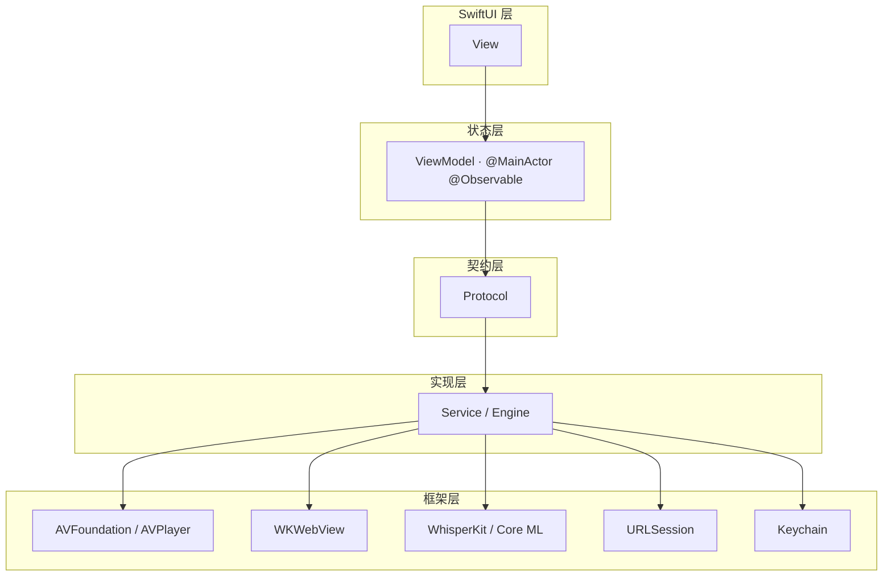

# AI Video Player — 架构文档

> 本文档是项目架构的事实来源。任何代码改动都不得违背「不可违反规则」章节中的内容。

## 1. 项目目标

高质量、可扩展、可维护、性能稳定、符合 Apple 原生设计规范的长期 iOS 项目。
产品形态：PotPlayer + 浏览器 + AI 实时字幕 + 远程文件浏览器的原生 iOS 视频播放器。

## 2. 分层架构



**数据流：View → ViewModel → Protocol → Service/Engine → Framework**

依赖方向永远向下；UI 层不知道具体实现类型，只知道协议。

| 层 | 职责 | 约束 |
|---|---|---|
| View | 纯展示与手势；绑定 ViewModel 状态 | 不持有业务逻辑；单文件 ≤ 300 行 |
| ViewModel | `@MainActor @Observable`；持有页面状态与协议依赖；发起可取消 Task | 不直接接触 AVPlayer / URLSession / WhisperKit |
| Protocol | 契约，业务与实现之间的唯一接口 | 业务层只依赖协议，不依赖具体实现 |
| Service / Engine | 实现协议，封装框架能力 | 可替换；通过 init 注入 |
| Framework | Apple / 第三方框架 | 只在 Service 层被触碰 |

## 3. 模块职责

| 目录 | 职责 | 当前 Phase |
|---|---|---|
| `App/` | App 入口、Tab 路由、全局状态（AppEnvironment） | 1 |
| `DesignSystem/` | Liquid Glass 组件（GlassCard / GlassBadge / GlassIconButton / GlassProminentButton / GlassTogglePill）、Theme 设计令牌 | 1 |
| `Features/Browser/` | 浏览器（地址栏/历史/收藏 + WKWebView）、媒体提取入口与远程文件浏览（WebDAV 目录导航） | 2 → 4 |
| `Features/Player/` | 播放器 UI 与状态（PlayerView + PlayerViewModel） | 3 → 6/7.6-7.9 |
| `Features/Subtitle/` | AI 字幕状态卡 + 整句字幕叠加（双语/单语）+ 共享字幕记录（SubtitleStatusCard / SubtitleOverlay + ViewModel / SubtitleTranscriptStore） | ✅ 5/6 → 8.6 |
| `Features/Settings/` | 设置页（隐私说明 + AI 字幕设置（开关 / 状态统计 / 字幕语言 / 字幕记录 / 字幕显示）+ 翻译服务） | 1（占位）→ 5/7/8.5-8.6 |
| `Core/Protocols/` | 12 个核心协议（见第 4 节） | 1 → 7 |
| `Core/Models/` | 12 个数据模型（见第 5 节） | 1 → 7 |
| `Core/Mock/` | Mock 数据与 Mock 实现（浏览器/凭据/状态） | 1-2 |
| `Core/Networking/` | WebDAV 目录浏览（PROPFIND；SMB / FTP 后续补充） | 2 |
| `Core/Storage/` | Keychain 凭据、UserDefaults 配置/历史/收藏 | 2 |
| `AI/Speech/` | WhisperKit 语音识别（实时路径）；AudioPipeline / WhisperKitSpeechRecognizer / SubtitlePipeline | ✅ 5 → 8.5 |
| `AI/Translation/` | 可替换翻译引擎（Fast NMT / 本地 LLM / 云端 API） | ✅ 7 |
| `Services/` | 业务服务（Playback / MediaExtractor） | 3-4 |
| `Utilities/` | 日志等通用设施 | 1 |

## 4. 核心协议

| 协议 | 职责 | 实现计划 |
|---|---|---|
| `MediaExtractor` | 网页 / 远程目录 → `[MediaItem]` | ✅ Phase 4（WebMediaExtractor） |
| `PlaybackEngine` | 封装 AVPlayer 生命周期（加载/播放/暂停/seek/倍速/音量） | ✅ Phase 3（AVPlayerPlaybackEngine） |
| `SpeechRecognizer` | 本地实时识别，输出 `AsyncStream<SubtitleSegment>`（partial / final） | ✅ Phase 5（WhisperKitSpeechRecognizer） |
| `TranslationEngine` | 文本翻译（可替换） | ✅ Phase 7（Fast NMT / 本地 LLM / 云端 API） |
| `RemoteFileBrowsing` | 远程文件浏览（connect / listDirectory / disconnect） | ✅ Phase 2（WebDAV；SMB / FTP 后续补充） |
| `SubtitleStatusProviding` | AI 字幕状态来源（状态流 + toggle） | ✅ Phase 5（SubtitlePipeline） |
| `CredentialStoring` | 密码存取（生产实现 Keychain） | ✅ Phase 2 |
| `RemoteServerProfileStoring` | 服务器配置存取（非敏感信息） | ✅ Phase 2 |
| `BrowserHistoryStoring` | 浏览历史存取 | ✅ Phase 2 |
| `BookmarkStoring` | 收藏存取 | ✅ Phase 2 |
| `APIKeyStoring` | 云端翻译 API Key 存取（生产实现 Keychain） | ✅ Phase 7 |

业务层只依赖协议；具体实现（AVPlayer、WhisperKit、翻译 API）在各自 Phase 通过依赖注入接入。

## 5. 数据模型

| 模型 | 说明 |
|---|---|
| `MediaItem` | 可播放媒体资源（视频/音频、来源） |
| `RemoteFile` | 远程目录条目（类型、连接协议、大小、时间） |
| `SubtitleSegment` | 字幕行（时间区间、原文、译文、置信度、partial/final） |
| `AIState` | AI 字幕七态：OFF / LOADING / LISTENING / TRANSCRIBING / TRANSLATING / READY / ERROR |
| `AISubtitleStatus` | AI 字幕子系统状态快照 |
| `PlaybackState` | 播放状态机（idle / loading / ready / playing / paused / ended / failed） |
| `PlaybackProgress` | 播放进度快照（当前时间 / 时长 / 倍速） |
| `LoadState` | 异步加载五态：loading / ready / empty / error / cancelled |
| `RemoteCredentials` | 远程连接凭据（仅内存会话使用） |
| `RemoteServerProfile` | 服务器配置（名称 / 根 URL / 用户名；密码走 Keychain） |
| `BrowserHistoryEntry` | 浏览历史条目 |
| `Bookmark` | 收藏条目 |

## 6. 依赖注入

ViewModel 通过 init 接收协议实现，默认值指向 Mock，替换实现无需改动调用方：

```swift
BrowserViewModel(historyStore: any BrowserHistoryStoring = UserDefaultsHistoryStore(),
                 bookmarkStore: any BookmarkStoring = UserDefaultsBookmarkStore())
RemoteFilesViewModel(browser: any RemoteFileBrowsing = WebDAVFileBrowser(),
                     credentialStore: any CredentialStoring = KeychainCredentialStore(),
                     profileStore: any RemoteServerProfileStoring = UserDefaultsProfileStore())
SubtitleStatusViewModel(provider: any SubtitleStatusProviding = MockSubtitleStatusProvider())
```

真实实现（Phase 5）以相同方式注入：`SubtitlePipeline` 通过 `AppEnvironment` 全局共享，
浏览器首页状态卡与播放器使用同一实例；Mock 保留作为测试 / 预览兜底。

## 7. 状态管理与取消

- 所有 async Task 必须支持取消：`Task.checkCancellation()` + generation 令牌防止过期结果覆盖。
- 状态必须显式表达：`LoadState` 五态、`AIState` 七态、`PlaybackState` 状态机。
- 流式数据使用 `AsyncStream`（如 `SubtitleStatusProviding.statusStream`），随宿主视图 `.task` 生命周期自动取消。

## 8. 未来接入方式

### 8.1 AVPlayer（Phase 3）

1. 实现 `PlaybackEngine`：新建 `Services/Playback/AVPlayerPlaybackEngine`（`@MainActor`），封装 AVPlayer 的
   加载、播放、暂停、seek、倍速、音量，并暴露状态流（`AsyncStream<PlaybackState>`）供 ViewModel 消费。
2. 注入：`PlayerViewModel(engine: any PlaybackEngine)`，UI 只读 ViewModel 状态。
3. 禁止：View 或 ViewModel 直接持有 AVPlayer / AVPlayerLayer。

#### 8.1.1 全屏与方向（设计约束）

播放器必须提供类 YouTube 的全屏体验，满足以下硬性要求：

1. 使用 AVPlayer + SwiftUI 自定义播放器 UI，**不依赖 AVPlayerViewController**。
2. 支持播放器内部横屏切换（视频内容横屏时，播放器可旋转为横屏）。
3. 用户开启系统竖屏锁定时：
   - 点击全屏仍可进入横屏播放；
   - 退出全屏后恢复系统原方向。
4. 全屏模式隐藏非播放器 UI（Tab Bar、Navigation Bar、状态栏）。
5. 支持 iPad 多任务（Split View / Stage Manager）与不同尺寸类（compact / regular）适配。
6. 横屏与方向逻辑必须封装在 Player 模块内部（如 `PlayerOrientationController`），
   通过环境值/协议暴露给播放器 UI；**不得污染其他页面**，其他页面始终跟随系统方向。

实现约束：

- 方向覆盖使用受支持的系统机制（`supportedInterfaceOrientations` 委托 / Scene 级方向策略），
  禁止使用私有 API（如 `UIDevice.setValue`）——存在 App Store 审核风险。
- 全屏状态由 PlayerViewModel 持有（如 `isFullScreen`），方向控制器只响应此状态，
  播放器自身不持有全局方向状态。
- 若全屏后设备仍保持竖屏（自动旋转被系统锁定或失败），全屏控制栏提供「横屏全屏」手动按钮
  （`PlayerOrientationController.requestLandscape`）作为兜底，并可手动恢复竖屏。
- 控制栏提供「画面大小」滑块（0.5x...2.0x 缩放），仅影响播放画面显示，不影响布局与全屏逻辑。

#### 8.1.2 调试入口（开发期专用）

播放器空状态提供「播放示例媒体（调试）」按钮，加载 `MockRemoteFiles.sampleMediaItem`，
仅用于没有远程服务器时在开发期快速验证播放器，**不属于正式功能**。

示例媒体优先使用构建时内置的小体积 MP4（`scripts/fetch-sample-video.sh` 从 CDN 下载，
约 1 MB，存于 `Resources/Samples/`，git 忽略；可用环境变量 `SAMPLE_VIDEO_URL` 更换源），
离线可播；未内置时回退到远程示例 URL（原 googleapis 链接已返回 403，回退改用
test-videos.co.uk）。

Phase 8.0 起，调试入口优先加载 `Resources/Samples/test.mp4`（本地普通话测试视频，
约 9 MB，git 忽略、手动放置；同目录 `test.txt` 是其正确转写文本，随 App 打包并入库）。
两者用于语音识别回归验证：播放 `test.mp4` 时，字幕应与 `test.txt` 内容一致。
注意：`test.mp4` 不入库，GitHub Actions 打包的 IPA 不含它，设备上会回退到
`sample.mp4` / 远程示例；需验证普通话识别时，在本地 macOS 构建前手动放入该文件。

- **删除方法**：移除 `PlayerView.emptyState` 中的调试按钮及对应文案即可；
- 正式入口为「远程文件视频行 → `AppEnvironment.requestPlayback`」，与调试按钮相互独立，
  删除调试按钮不影响播放链路。

### 8.2 WhisperKit（Phase 5）

1. 依赖：SPM `argmaxinc/argmax-oss-swift from 1.0.0`（产品 `WhisperKit`，CI 解析 1.1.0，iOS 16+）。
2. 模型内置：`scripts/fetch-whisper-model.sh` 构建时从 HuggingFace 打包
   `openai_whisper-tiny`（可用环境变量 `WHISPER_MODEL_NAME` 更换）与配套 tokenizer 到
   `Resources/Models/whisperkit-coreml`（git 忽略，CI 缓存），`WhisperKit(modelFolder:download:false)`
   从 App 内置资源加载；应用内没有模型下载 / 选择步骤（只有 Phase 7 翻译 LLM 才需用户选择下载）。
3. `AudioPipeline`（AI/Speech，负责从播放器或麦克风取音频）：
   - `AssetReaderAudioPipeline`：AVAssetReader 以高于实时的速度解码 PCM（16kHz 单声道），
     本地 / 渐进式媒体适用；
   - `PlayerAudioPipeline`：MTAudioProcessingTap 挂到当前 AVPlayerItem 的 audioMix 实时捕获 PCM，
     HLS / 读取器不可用时的降级路径；
   - `MicrophoneAudioPipeline`：WhisperKit AudioProcessor 实时采集（partial → final）。
4. `SpeechRecognizer` 实现：`AI/Speech/WhisperKitSpeechRecognizer`，把 WhisperKit 的 partial / final
   映射为 `SubtitleSegment` 并写入 `AsyncStream`；窗口转写自动重采样到 16kHz、
   清理 special token、置信度近似映射、语言检测。
5. `SubtitleStatusProviding` 真实实现：`AI/Speech/SubtitlePipeline`，通过 `AppEnvironment`
   全局共享，替换 Mock 注入到 `SubtitleStatusViewModel`；状态语义见 8.2.1。
6. 播放器联动：`PlayerViewModel` 注入共享管线——播放 / seek 前重建并启动音频来源，
   暂停 / 播放结束停止识别循环。
7. 字幕结果写入共享 `SubtitleTranscriptStore`（原文 + 译文，有界保留最近 200 条）：
   播放器 Overlay 与设置页「字幕记录」卡片直接读取，不再依赖单次消费的流。
8. 隐私：音频不离开设备，模型本地内置加载。

#### 8.2.1 实时识别路径（Phase 8.5：超前识别已移除）

Phase 8.5 起**删除超前识别（Lead-Ahead）功能**（设置开关 / Δ 窗口 / 播放前预读等待均移除），
字幕管线统一走实时路径：

- 固定 5 秒窗口，`SpeechRecognizer` 按 partial → final 输出；partial 逐词出现、
  final 到达后由字幕记录收敛为整句（final 优先）。
- 识别游标只进不退；识别速度跟不上播放时跳过已落后的窗口、从当前播放位置继续；
  seek / 暂停恢复后丢弃过期结果（final 整句已播完才丢弃，partial 不按播放位置丢弃，
  避免「识别已产出但播放器无字幕」）。
- 翻译紧随 final 识别完成，译文写入 `SubtitleSegment.translatedText`。
- 状态语义：LISTENING / TRANSCRIBING / TRANSLATING 表示识别 / 翻译进行中，
  READY 表示窗口转写完成。
- 识别循环容错：模型仍在加载时收到转写请求，识别器抛出「引擎未就绪」普通错误
  （不是 CancellationError），循环短暂等待后重试，避免模型加载竞态导致识别永久退出；
  播放中途才打开字幕时，激活路径用引擎当前真实时间（而非上次播放开始时间）重建识别游标。
- 识别参数（Phase 8.1 保留）：转写使用标准 prefill（SOT + 语言 + 任务 + 时间戳），
  首窗自动检测语言后把语言代码传给后续窗口（避免中文 / 短音频逐窗检测失败）；
  设置页展示识别状态统计（模型加载 / 转写窗口 / 字幕产出）与「字幕记录」原文 / 译文，
  关键链路有 OSLog 日志，便于排查「识别正常但显示异常」。

### 8.3 TranslationEngine（Phase 7）

`TranslationEngine` 保持单一协议（Provider 元数据 + `translate(_:from:to:context:)`），
翻译能力由多个可替换的 Provider 实现，用户可在设置页选择；译文写入
`SubtitleSegment.translatedText`（final 段在 `SubtitlePipeline` 内翻译后透出）。

**Provider 类型：**

1. **Fast NMT Provider（本地轻量翻译）**：使用 Apple 原生 Translation 框架
   （iOS 26 可直接初始化 `TranslationSession(installedSource:target:)`），适合极速、低消耗场景；
   完全本地运行，文本不出设备；依赖系统翻译语言包，未安装 / 不支持时给出可读提示，无需配置。
2. **Local LLM Provider（本地大模型）**：基于 MLX Swift（`mlx-swift-lm` 3.x + `swift-transformers`
   Tokenizer），默认模型 Gemma 4 E2B 4-bit（`mlx-community/gemma-4-e2b-it-4bit`，约 3.5 GB，
   对应官方 `LLMRegistry.gemma4_e2b_it_4bit`），完全离线运行；
   无网络依赖，可在上下文润色模式下提供剧情感知翻译。
   **模型按需下载，不随 App 预置**：用户在设置页选择要使用的模型，点击「下载」后
   由 `LocalModelDownloadManager` 从 Hugging Face 拉取模型文件（逐文件进度、失败重试、
   取消、删除、文件校验）；下载完成后才能启用该 Provider。
3. **Cloud LLM Provider（云端 API）**：基于 OpenAI 兼容格式（ChatCompletions API），支持用户自定义
   `baseUrl`、`apiKey`、`modelName`（如 deepseek-chat、gpt-4o-mini、claude-3-5-haiku 等）。
   apiKey 存 Keychain（`KeychainAPIKeyStore`），不落 UserDefaults。
   启用前必须展示提示：「字幕文本将发送到你配置的翻译服务」。
   **配置后提供「测试连接」按钮**：填入 key / baseUrl / model 后先测试连通性与鉴权，
   测试成功（并确认隐私提示）才允许保存并启用；测试失败需展示具体错误提示。

**上下文润色（可选开关）：**

- 「剧情理解润色」开关**仅适用于本地 LLM 与云端 API**：开启后，会先理解当前剧情的上下文
  （历史字幕窗口），再基于语境翻译并润色，提升连贯性与可读性。
- **Fast NMT Provider 不参与上下文理解**：直接执行翻译，不发送上下文、不做润色，
  因此也不涉及上下文压缩。
- 必须注意**自动压缩文本**：向 LLM 发送上下文时需自动压缩（截断 / 摘要 / 滑动窗口），
  控制 token 消耗与延迟，避免上下文溢出。

**实现约束：**

1. 每个 Provider 都实现 `TranslationEngine` 协议；云端额外实现
   `TranslationConnectionTesting`（测试连接），通过依赖注入接入字幕管线；
   译文写入 `SubtitleSegment.translatedText`。
2. 设置页提供 Provider 选择与对应配置（Base URL / API Key / Model）；
   目标语言在独立「字幕语言」卡片选择（Phase 8.6，12 种语言）。
3. 隐私：Fast NMT 与 Local LLM 完全本地；Cloud LLM 必须先行展示隐私提示；
   API Key 只存 Keychain。
4. 上下文窗口与压缩策略由独立组件管理（`TranslationContextProvider`：滑动窗口 +
   逐条截断 + 总预算压缩），
   禁止把大段原始字幕直接塞进请求。
5. `SubtitlePipeline` 接入：final 段翻译后写入 `translatedText` 再写入字幕记录；
   partial 原样透出（实时路径逐词不翻译）；
   翻译禁用 / Provider 未就绪 / 单句失败时原样透出原文；翻译期间状态进入 `.translating`，
   完成后恢复原状态；设置变更（Provider / 云端配置 / 本地模型 / 润色开关）后重建引擎缓存。
6. 本地 LLM 模型按需下载：不随 App 预置；设置页提供模型选择、下载（Hugging Face 拉取，
   进度 / 失败重试 / 取消）、已下载模型管理与删除；下载完成后才能启用该 Provider。
7. Cloud LLM 配置提供「测试连接」按钮：向配置的服务发起一次最小请求，
   验证 baseUrl / apiKey / modelName 可用；测试成功才允许保存启用，失败需给出可读错误提示。
8. 语言选择（Phase 8.6）：设置页独立「字幕语言」卡片——「原语言」提供
    自动检测 + 12 种语言（简体中文 / English / 日本語 / 한국어 / Bahasa Melayu /
    Filipino / ไทย / Tiếng Việt / Bahasa Indonesia / Français / Deutsch / Español），
    「翻译语言」同样 12 种；系统翻译（Apple Translation）仅支持其语言对
    （运行时 `LanguageAvailability` 检查），不支持时给出可读提示。
9. 语言生效机制（Phase 8.6）：源语言手动指定时，Whisper 识别直接使用该语言
    （不再等待自动检测），翻译源语言同步切换；自动检测时识别语言跟随模型判断、
    翻译源语言由识别结果映射（如识别 "zh" → 翻译源 "zh-Hans"）；
    切换源 / 目标语言会重建翻译引擎（`engineCacheKey` 包含两种语言代码），
    Fast NMT 按新语言对初始化；选择持久化于 UserDefaults。

### 8.4 远程文件与浏览器（Phase 2）

1. 实现 `RemoteFileBrowsing`（WebDAV → SMB → FTP），替换 `MockRemoteFileBrowser`。
2. 凭据只存 Keychain（`Core/Storage/`）。
3. `HomeView` 的 Mock 地址栏替换为真实 WKWebView 浏览器，保持 Liquid Glass 设计不变。

### 8.5 MediaExtractor（Phase 4）

1. 实现 `MediaExtractor`：新建 `Services/Media/WebMediaExtractor`（`Sendable`，URLSession + Foundation 解析，
   无第三方依赖）。
   - 直链媒体（MP4 / MOV / WebM / MP3 / M4A 等）→ 单个 `MediaItem`，不发起网络请求；
   - HLS（`.m3u8` / `.m3u`）→ 单个视频 `MediaItem`，master / variant 播放列表由 AVPlayer 原生处理；
   - HTML 页面 → 提取 `<video>` / `<source src>` / `data-src`，相对地址转绝对、HTML 实体解码、去重；
     标题按「页面 title → poster → 文件名」兜底。
2. 注入：`BrowserViewModel(mediaExtractor: any MediaExtractor = WebMediaExtractor())`，UI 只读
   `extractedMedia`（`LoadState<[MediaItem]>` 五态）。
3. 入口：浏览器地址栏「提取视频」按钮 → `MediaExtractionSheet` 结果列表 →
   `AppEnvironment.requestPlayback`。**删除方法**：移除 `AddressBarView.onExtractMedia` 按钮与
   `MediaExtractionSheet` 即可回到纯浏览。
4. 远程目录：`RemoteFile.Kind.infer` 将 `m3u8` / `m3u` 识别为 video，走既有
   `mediaItem(from:) → requestPlayback` 链路。
5. 不绕过 DRM：只提取普通 HTTP(S) 媒体地址；带 `encrypted` 等加密标记或非 HTTP(S) 协议的资源
   一律跳过，不做任何解密或绕过。
6. 取消与状态：URLSession 请求随 Task 取消，解析过程 `checkCancellation()`；`extractedMedia`
   显式表达 loading / ready / empty / error / cancelled。

### 8.6 SubtitleOverlay（Phase 6 → 8.5/8.6）

1. 共享数据源：`Features/Subtitle/SubtitleTranscriptStore`（@MainActor @Observable）——
   字幕管线每条识别 / 翻译结果（原文 + 译文）写入这里，有界保留最近 200 条；
   `segment(at:)` 按播放光标返回当前整句（final 优先于重叠 partial，区间左闭右开）；
   append final 时清理被其时间区间覆盖的旧 partial（partial → final 收敛）。
2. `SubtitleOverlayViewModel`（@MainActor @Observable）：直接读取共享
   `SubtitleTranscriptStore`，按播放光标计算当前句子（整句一次性出现，不逐词跳动）；
   播放器 Tab 反复进出 / 全屏切换不会中断显示链路（不再消费单次迭代的 AsyncStream）；
   拖动位移换算为归一化坐标（边界 0.08...0.92）；换片 / 管线关闭时清空记录与当前字幕。
3. `SubtitleDisplaySettings`：字号（小 / 中 / 大）、双语显示开关与字幕中心点
   归一化位置，UserDefaults 持久化，提供 `resetPosition()`；由 `AppEnvironment`
   全局共享（播放器叠加层与设置页使用同一实例）。
4. `SubtitleOverlay` 视图（Phase 8.6）：双语显示开启时上行原文（小字号，
   约为译文一半）、下行译文（主行大字号）；关闭时只显示译文一行
   （译文缺失时显示原文）；原生 Liquid Glass 玻璃条（不使用任何模拟玻璃 API）；
   整句一次性出现 / 消失动画；`DragGesture` 拖动调整位置；
   叠加在播放画面之上、控制栏之下。
5. 接入：`PlayerView` 与 `FullscreenPlayerView` 在「字幕开关开启且管线激活」时
   渲染 Overlay（`SubtitleLayer`）；播放器字幕开关打开时会自动激活共享管线
   （不再要求先去设置页 / 首页单独开启）；管线已在别处激活时播放器默认显示字幕；
   开关开启但引擎加载中 / 出错 / 已关闭时，画面顶部显示状态胶囊（`SubtitleStatusPill`），
   明确识别引擎状态；换片时清空时间线；管线关闭时清空当前字幕，避免过期内容残留。
6. 设置页「字幕记录」卡片（`SubtitleTranscriptCard`）：展示最近已识别字幕的
   原文 + 译文 + 时间，支持一键清空；用于排查「识别已产出但播放器无字幕」，
   可直接确认识别 / 翻译结果是否到达显示链路。
7. 设置页「字幕语言」卡片（`SubtitleLanguageCard`，Phase 8.6，与字幕记录同层级）：
   原语言（自动检测 + 12 种语言）与翻译语言（12 种语言）选择 + 双语显示开关；
   修改即持久化并调用 `SubtitlePipeline.rebuildTranslationEngine()`，
   保证下次识别 / 翻译立即按新选择生效。

### 8.7 打包与分发（Release IPA / 自签）

1. `release-ipa.yml`（手动触发）：macOS runner 上 `xcodebuild build -sdk iphoneos
   -configuration Release` 以 `CODE_SIGNING_ALLOWED=NO` 产出**未签名** `.app`，
   复制为 `Payload/` 后用 `zip` 打包为标准 IPA。
2. 用 `gh`（`GITHUB_TOKEN`，`contents: write`）创建/更新 GitHub Release，
   上传 `AIVideoPlayer-<版本>-unsigned.ipa`；同名 tag 已存在时仅覆盖上传资产。
3. IPA 未签名：用户用自签工具（Sideloadly / AltStore / 爱思助手）以自己 Apple ID 重签安装；
   需要 iOS 26 及以上设备（deployment target 26.0）。
4. 与主 CI（`swift-ci.yml`）职责分离：主 CI 负责编译 + 单元测试，`release-ipa.yml`
   负责分发产物；两者互不触发。
5. 版本约定：同一 Phase 内每次打包 IPA 后，下一次打包版本递增一个小版本
   （如 `0.8.0` → `0.8.1`），文档中的 Phase 编号同步递增；
   打包时同步提升 `MARKETING_VERSION`（project.yml）与两个 IPA 工作流的默认版本号。
6. CI 监控与通知约定：push 后 Codex 主动监控 `swift-ci.yml` 运行结果——通过则直接触发
   `package-ipa.yml`（`Package IPA (unsigned)`）打包，打包结束后通过 Bark 推送通知用户；
   失败则尝试拉取日志修复，多次尝试仍无法拉取时通过 Bark 推送通知用户帮忙下载日志。
   推送链接：`https://api.day.app/e9Ag3rveUM3ZGJqGQDb2oU/<推送内容>`。

### 8.8 播放器换片复位与状态机（Phase 7.6/7.7）

- 换片加载前先 `avPlayer.pause()`，避免新条目因 rate 保持 1 自动播放，
  导致加载完成的 `.ready` 覆盖播放态（播放按钮错乱）。
- `PlayerViewModel.load` 先复位（进度 / 状态 / 字幕循环）再异步加载：
  新加载取消旧加载任务 + generation 守卫，旧任务（超时/失败）结果不覆盖新状态。
- 状态机不变量：`.playing` 不允许被 `.ready` 回退；VM 仅在仍处于 `.loading`
  时置 ready。
- `waitUntilReady` 检测到当前条目被替换即视为本加载失效（CancellationError），
  避免过期加载空转 60 秒超时后污染状态。
- 时长兜底：HLS / 时长未就绪时 `currentItemDuration` 用可 seek 范围末端近似，
  保证进度条显示与拖动范围正确（否则 slider 范围退化为 0...1，拖动即从头播）。
- 手动初始化：控制栏「重新初始化播放器」按钮与失败态「重试」按钮
  调用 `PlayerViewModel.reinitialize()` 重新加载当前媒体。

### 8.9 播放器状态/进度兜底与细节优化（Phase 7.8/7.9）

- 权威状态：引擎 `play()` / `pause()` 直接维护状态（不再只依赖 `timeControlStatus`
  KVO 回调），VM 播放控制/seek/加载后从引擎同步 `playbackState`；
  引擎 0.5s 兜底节拍器周期读取时间/时长/状态并推送，VM 另有轮询双通道，
  流未送达时 UI 仍能更新（播放按钮、时间、进度条）。
- 时长未知（HLS 未填充 seek 范围）时进度条禁用拖动，避免 0...1 退化范围
  把任意拖动变成从头重播；`seek` 目标收敛到已知时长。
- 视频横竖屏：加载时异步读取视频轨自然尺寸（宽 > 高为横屏，未知按竖屏），
  横屏视频进入全屏默认横屏；全屏内横/竖屏合并为单个切换按钮
  （由 `PlayerOrientationController.isLandscape` 判定当前方向）。
- 控制栏「设置」二级菜单收纳重新播放 / 画面比例 / 重新初始化；音量已移除。

## 9. 设计原则与不可违反规则

### 设计原则

- 协议先行：先定义契约，再决定实现；实现可以替换。
- 依赖注入：View / ViewModel 通过 init 获得依赖，禁止内部 new 具体业务实现。
- 状态显式：任何异步过程都有明确的 loading / ready / error / empty / cancelled 表现。
- 内容优先：玻璃是漂浮在内容之上的交互层，不是覆盖内容的背景层。
- Liquid Glass 以 `liquid-glass-design` skill 为设计依据（见红线 11）。
- 最小改动：每个变更只针对当前 Phase 的目标，禁止顺手实现后续功能。

### 不可违反规则（红线）

1. View 不能直接处理 AVPlayer、URLSession、WhisperKit、网络协议、API 调用。
2. 禁止 Massive View：单个 View 超过 300 行必须拆分。
3. 禁止把所有逻辑写进 `ContentView.swift`。
4. 禁止为方便创建大量 Singleton。
5. 所有 async Task 必须支持取消。
6. 所有状态必须显式：Loading / Ready / Error / Empty / Cancelled。
7. UI 禁止使用 `.blur()` / `.opacity()` / `.ultraThinMaterial` 模拟玻璃；必须使用 iOS 26 原生
   Liquid Glass API（`glassEffect` / `GlassEffectContainer` / `.glass` / `.glassProminent`）。
8. 禁止提前实现后续 Phase；每个 Phase 完成时必须编译 + 测试 + 架构检查。
9. 第三方库 API 不确定时先查官方文档 / Package.swift / 源码，禁止编造 API。
10. 隐私红线：视频/音频不上传；凭据只存本机 Keychain；翻译服务启用前必须明确提示。
11. Liquid Glass UI 必须遵循 `liquid-glass-design` skill
    （`D:\code\CodeX\.agents\skills\liquid-glass-design\SKILL.md`）：多玻璃元素放入
    `GlassEffectContainer`；仅交互元素使用 `.interactive()`；变形过渡使用
    `@Namespace` + `glassEffectID` + `withAnimation`；禁止脱离该 skill 自创玻璃写法。

## 10. 隐私承诺

- 视频、音频默认不上传；Whisper 完全本地运行。
- 远程账号密码只保存在本机 Keychain。
- 翻译服务启用前必须明确提示：「字幕文本将发送到你配置的翻译服务」。
- 不收集视频、字幕、浏览历史、服务器文件列表。

## 11. Phase 规划

1. **Phase 1（已完成）**：App 初始化、目录、Tab/Navigation、Liquid Glass Design System、首页、Mock、核心协议、测试、CI。
2. **Phase 2（已完成）**：WKWebView 浏览器（地址栏/历史/收藏）+ WebDAV 远程文件 + Keychain 凭据；
   SMB / FTP 由后续阶段补充。
3. **Phase 3（已完成）**：AVPlayer 封装（播放/暂停/进度/倍速/音量/全屏/比例/字幕控制）。
4. **Phase 4（已完成）**：MediaExtractor（HTML5 video / MP4 / HLS / M3U8；不绕过 DRM）。
5. **Phase 5（已完成）**：WhisperKit AudioPipeline + SpeechRecognizer 实时识别
   （固定 5 秒窗口，partial → final；识别游标只进不退、落后窗口跳过）。
6. **Phase 6（已完成）**：SubtitleOverlay（双语、整句按播放光标对齐一次性出现、拖动、样式）。
7. **Phase 7（已完成）**：TranslationEngine —— Fast NMT / 本地 LLM / 云端 API 三类 Provider
   （Base URL / API Key / Model / Language 配置）；剧情理解润色开关（自动压缩文本）；
   final 段识别后即时翻译；明确隐私提示。
8. **Phase 7.5（已完成）**：成品 Debug（8 类缺陷）+ 实测反馈完善（浏览器命令修复、
   视频接管、内置示例视频、地址栏清空按钮、打包 action）。
9. **Phase 7.6（已完成）**：播放器换片复位（先初始化再加载、旧加载取消 +
   generation 守卫）+ 手动初始化按钮。
10. **Phase 7.7（已完成）**：播放器状态与进度修复（换片先暂停、状态机
    禁止 playing 被 ready 回退、时长兜底、CMTime 编译修复）。
11. **Phase 7.8（已完成）**：播放器状态与进度兜底（引擎权威状态 + 节拍器 +
    VM 双通道 + 时长未知禁拖）。
12. **Phase 7.9（已完成）**：播放器细节优化（设置二级菜单、删除音量、横竖屏
    检测与默认方向、横/竖屏单按钮）+ 浏览器主页标签页、返回主页与左缘右滑返回。
13. **Phase 7.10（已完成）**：横屏识别修复（preferredTransform + 全屏入口重新
    检测）+ 横/竖屏切换修复（刷新方向掩码 + 失败重试）+ 主页媒体来源
    （WebDAV / 相册）。
14. **Phase 7.11（已完成）**：实测反馈修复（相册视频导出后播放、文件来源
    fileImporter、媒体来源编辑模式删除、全屏自动横屏检测与旋转重试）。
15. **Phase 7.12（已完成）**：文件来源导入改为复制到 App 沙盒
    （Documents/MediaFiles），修复书签授权跨启动失效。
16. **Phase 7.13（已完成）**：移除文件来源导入功能（保留 `MediaSourceKind.files`
    枚举值与占位入口，便于后期恢复），媒体来源保留 WebDAV / 相册。
17. **Phase 7.x 系列（已完成）**：用 7.x 的数个小版本修好播放器功能（7.5–7.13 收尾）。
18. **Phase 8.0（已完成，打包 0.8.0）**：修复「播放视频没有字幕」的核心链路——
    播放器字幕开关联动识别管线、播放中途激活用真实播放时间重建游标、
    模型加载期识别循环自动重试；内置普通话测试素材（`test.txt` 入库随包，
    `test.mp4` 仅本地构建随包）。
19. **Phase 8.1（已完成，打包 0.8.1）**：修复「开关已生效但看不到字幕」——
    识别参数修正（标准 prefill + 语言传递）、识别游标跟随播放位置并跳过落后窗口、
    设置页识别状态统计。
20. **Phase 8.2（❌ 失败，打包 0.8.2，代码已弃用）**：翻译功能增强——系统翻译 / 本地大模型
    （Gemma 4 E2B 按需下载）/ 云端 API 可选；原语言与目标语言选择；多语言池
    12 种、设置页可勾选呈现并排序；播放器字幕开启后出现「字幕语言」按钮。
21. **Phase 8.3（❌ 失败，打包 0.8.3，代码已弃用）**：实测反馈修复——播放器字幕开关随识别
    管线激活 / 关闭自动同步；实时路径 partial 不再被过期判定丢弃；识别统计按
    会话重置；设置页交互卡片启用 Liquid Glass interactive（修复语言 / Provider
    选择器无法操作）；播放器「字幕语言」菜单分栏标注原语言 / 目标语言。
    实测仍无法使用，代码已回退弃用。
22. **Phase 8.4（❌ 失败，打包 0.8.4，代码已弃用）**：在 0.8.1 基线上重建多语言与源/目标语言——
    全语言池 12 种（含日文等），设置页可勾选呈现并排序；设置页与播放器均可调整
    「原语言 / 目标语言」；播放器「字幕语言」按钮紧邻字幕开关、开启字幕后才出现，
    菜单分栏明确标注原语言 / 目标语言。实测仍无法使用，2026-08-10 结束并二次回退至
    0.8.1 基线。
23. **Phase 8.5（已完成，打包 0.8.5）**：删除超前识别（Lead-Ahead）功能；重构字幕
    显示链路——新增共享 `SubtitleTranscriptStore`（播放器 Overlay 与设置页直接读取，
    不再消费单次迭代的 AsyncStream，修复 Tab 反复进出后字幕丢失）；实时路径 partial
    不再按播放位置丢弃；设置页新增「字幕记录」卡片（已识别字幕原文 + 译文 + 清空），
    用于排查「识别已产出但播放器无字幕」。
24. **Phase 8.6（已完成，打包 0.8.6）**：新增字幕语言与双语显示——设置页新增
    独立「字幕语言」卡片（原语言自动检测 + 12 种 / 翻译语言 12 种 / 双语显示开关）；
    手动指定源语言后 Whisper 识别与翻译源语言立即生效（自动检测时跟随识别结果，
    识别 "zh" → 翻译源 "zh-Hans"）；切换语言重建翻译引擎；双语显示开启时
    上行原文（约译文一半字号）、下行译文，关闭时只显示译文。
25. **Phase 9 & Phase 9+（规划中）**：完成 Liquid Glass 深化（变形过渡）、性能、
    测试与错误处理。

> 禁止提前实现后续 Phase。变更记录见 [CHANGELOG.md](../CHANGELOG.md)。
